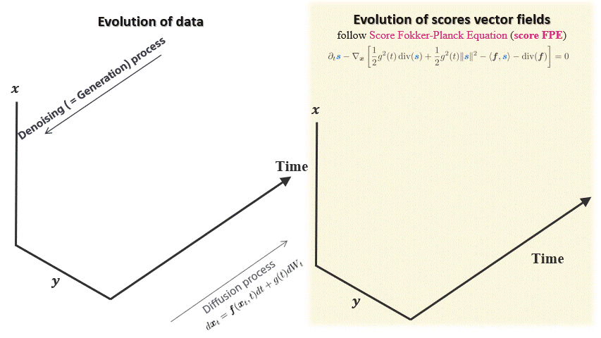

# PyTorch Implementation of FP-Diffusion (ICML 2023)
This repository houses the implementation of the paper titled "[FP-Diffusion: Improving Score-based Diffusion Models by Enforcing the Underlying Score Fokker-Planck Equation](https://arxiv.org/abs/2210.04296)", which was presented at ICML 2023.

## TL;DR
Improving density estimation of diffusion models by regularizing with its underlying PDEs which is termed score Fokker-Planck Equation, theoretically supported! 

<p align="center">

</p>

## Abstract

Score-based generative models (SGMs) learn a family of noise-conditional score functions corresponding to the data density perturbed with increasingly large amounts of noise. These perturbed data densities are linked together by the Fokker-Planck equation (FPE), a partial differential equation (PDE) governing the spatial-temporal evolution of a density undergoing a diffusion process. In this work, we derive a corresponding equation called the score FPE that characterizes the noise-conditional scores of the perturbed data densities (i.e., their gradients). Surprisingly, despite the impressive empirical performance, we observe that scores learned through denoising score matching (DSM) fail to fulfill the underlying score FPE, which is an inherent self-consistency property of the ground truth score.
We prove that satisfying the score FPE is desirable as it improves the likelihood and the degree of conservativity. Hence, we propose to regularize the DSM objective to enforce satisfaction of the score FPE, and we show the effectiveness of this approach across various datasets.

## Guidelines for Implementation

The FP-Diffusion code is constructed using the remarkable repository "[(Score SDE) Score-Based Generative Modeling through Stochastic Differential Equations](https://github.com/yang-song/score_sde_pytorch/)" as its foundation. 

### 1) Prereqruisites
Install the requirements via
``` pip install -r requirements.txt ```

### 2) Downloading the pre-trained models
The pre-trained models on CIFAR-10 can be dowloaded from "[Score SDE checkpoints](https://drive.google.com/drive/folders/1tFmF_uh57O6lx9ggtZT_5LdonVK2cV-e)" provided by Yang Song. 

Please make sure the checkpoint is saved at the right location `workdir/checkpoints-meta`, where `workdir` is specified in `main.py` file.

### 3) Fine-tuning with FP-Diffusion

The hyper-parameters of FP-Diffusion are specified at `configs/default_cifar10_configs.py`. The default setup for CIFAR-10 and ImageNet32 are

```
  ## Score FPE setups
  training.scalar_fp = 'both' #choices=['True', 'False', 'both']
  training.fp_wgt_type = 'll' #choices=['constant', 'convention', 'll']
  training.alpha = 0.15
  training.beta = 0.01
  training.m = 2
```

Execute ```main.py``` may start the training. We refer to "Usage" of [(Score SDE) Score-Based Generative Modeling through Stochastic Differential Equations](https://github.com/yang-song/score_sde_pytorch/) for the detailed instruction of `main.py`.

```
main.py:
  --config: Training configuration.
    (default: 'None')
  --eval_folder: The folder name for storing evaluation results
    (default: 'eval')
  --mode: <train|eval>: Running mode: train or eval
  --workdir: Working directory
```

## Citation
If you find this work interesting, please consider citing the paper: 


## Related works

This work is built upon some previous works which might also interest you:

* ICLR 2021,  [Score-Based Generative Modeling through Stochastic Differential Equations](https://github.com/yang-song/score_sde_pytorch/) by Yang Song, Jascha Sohl-Dickstein, Diederik P. Kingma, Abhishek Kumar, Stefano Ermon, and Ben Poole

* ICML 2022,  [Maximum Likelihood Training for Score-Based Diffusion ODEs by High-Order Denoising Score Matching](https://github.com/LuChengTHU/mle_score_ode) by Cheng Lu, Kaiwen Zheng, Fan Bao, Jianfei Chen, Chongxuan Li and Jun Zhu

